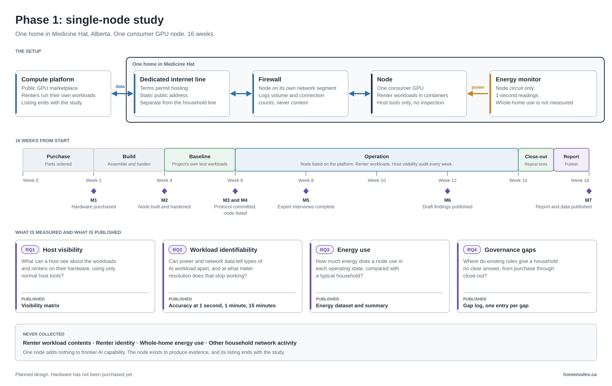

# Phase 1: Single-Node Study

**Status:** Planned. Hardware has not been purchased.
**Last updated:** 2026-10-09
**Related:** [PROTOCOL.md](PROTOCOL.md), [BUDGET.md](BUDGET.md), [RESEARCH-LIMITS.md](RESEARCH-LIMITS.md), [hardware/BOM.md](hardware/BOM.md), [Phase 2 plan](https://github.com/homenodes-1/homenodes-framework/blob/main/PHASE-2.md)

## Summary

Phase 1 runs one consumer GPU node in one home in Medicine Hat, Alberta, for 16 weeks. The node is listed on a public compute marketplace for eight of those weeks. The study measures what a household hosting AI compute can see, what its power and network data reveal, how much energy it uses, and where existing rules give the household no clear answer.

The method is fixed in advance. The [protocol](PROTOCOL.md) is committed before the node is listed, and results are reported against it.

## Research questions

| # | Question | Published output |
|---|---|---|
| RQ1 | What can a host see about the workloads and renters on their hardware, using only normal host tools? | Host visibility matrix |
| RQ2 | Can power and network data tell types of AI workload apart, and at what meter resolution does that stop working? | Accuracy at 1 second, 1 minute, and 15 minutes |
| RQ3 | How much energy does a node use in each operating state? | Energy dataset and summary |
| RQ4 | Where do existing rules give a household no clear answer? | Governance gap log |

RQ1 and RQ2 test the first and third pathways in the [threat model](https://github.com/homenodes-1/homenodes-framework/blob/main/drafts/threat-model-v0.1.md): use without a provider relationship, and detection.

## Setup

| Part | Detail |
|---|---|
| Home | One home in Medicine Hat. Node in the basement |
| Node | One consumer GPU (RTX 5080 class), 64 GB memory, Ubuntu Server. Full list in the [BOM](hardware/BOM.md) |
| Internet | A dedicated line whose terms permit hosting, with a static public address. Separate from the household line (gap log [G-001](gap-log/G-001.md)) |
| Network | Dedicated firewall. The node sits on its own segment and cannot reach household devices |
| Energy | Monitor on the node circuit only, recording at 1-second intervals |
| Platform | One public GPU marketplace. The listing end date is set to the last day of the operation period |

## Schedule

Week 0 is the point where hardware funding is confirmed, as in [BUDGET.md](BUDGET.md).

| Weeks | Stage | What happens |
|---|---|---|
| 0 to 2 | Purchase | Parts ordered. Actual costs recorded in the BOM |
| 2 to 4 | Build | Node assembled, hardened, and isolated on the home network |
| 4 to 6 | Baseline | The project's own labelled test workloads. Protocol v1.0 committed |
| 6 to 14 | Operation | Node listed. Renter workloads run. Host visibility audited at each rental and weekly |
| 14 to 15 | Close-out | Node unlisted. Test workloads repeated and compared with baseline |
| 15 to 16 | Report | Results, data, and gap log published |

Milestones M1 to M7 and the evidence for each are in [BUDGET.md](BUDGET.md).

## What is never collected

- Renter workload contents, files, or network payloads
- Renter identity or personal information
- Whole-home energy use
- Other household network activity

See the [ethics statement](https://github.com/homenodes-1/homenodes-framework/blob/main/ETHICS.md).

## Cost

| Item | CAD | USD |
|---|---|---|
| Node hardware, including GST | $5,523.00 | $4,030 |
| Dedicated internet line, four months, including GST | $1,133.79 | $828 |
| Price buffer | | $92 |
| **External funding need** | | **$4,950** |
| Electricity for the study period (self-funded) | About $150 | |

Research time is unpaid. The full breakdown is in [BUDGET.md](BUDGET.md).

## What Phase 1 cannot show

- **It is one home.** A finding may be about this household, this hardware, or this internet provider, and not about residential compute in general. Phase 2 addresses this.
- **Energy is measured at the node circuit.** Phase 1 does not test whether a node can be picked out of a whole-home meter signal.
- **It does not test aggregation.** Splitting work across many nodes and shutting down many nodes at once are in the threat model. Neither phase tests them.
- **One platform is trialled live.** Other platform types are compared from public documentation only.

## After Phase 1

The node stays in service as the reference node for [Phase 2](https://github.com/homenodes-1/homenodes-framework/blob/main/PHASE-2.md). The Phase 2 budget is revised from Phase 1 results before any household is recruited.
